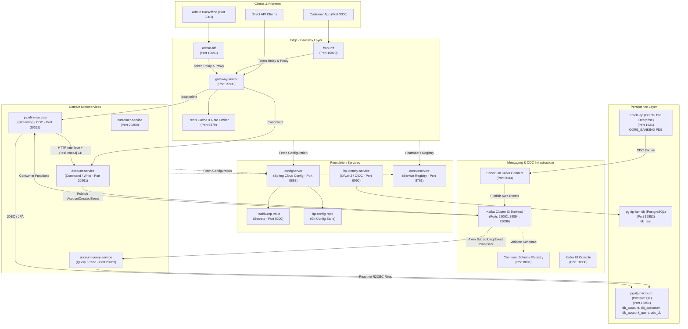
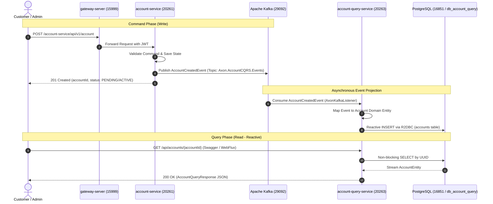
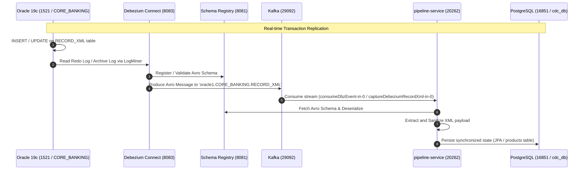

# ITP Banking Microservices Architecture Guide

This document provides a comprehensive technical overview of the **ITP Microservices Ecosystem**, detailing each microservice, its specific role, communication mechanisms, configuration mappings, and architectural diagrams.

---

## 1. High-Level Architecture Overview

The platform is designed as an **Enterprise Banking / FinTech Microservice Architecture** adhering to modern architectural patterns:
- **API Gateway & BFF (Backend for Frontend)**: Decouples frontend applications (Customer Web/Mobile vs. Admin Backoffice) with dedicated token-relaying proxies and rate limiters.
- **Service Discovery & Centralized Configuration**: Spring Cloud Eureka and Spring Cloud Config Server backed by Git and HashiCorp Vault.
- **Identity & Access Management (IAM)**: OAuth2.0 / OpenID Connect authorization server issuing cryptographically signed JWTs.
- **CQRS (Command Query Responsibility Segregation)**: Write operations are processed by `account-service` and published via Kafka; high-performance non-blocking reads are served by `account-query-service` using Spring WebFlux and R2DBC.
- **Change Data Capture (CDC) & Event Streaming**: Debezium captures transaction logs from **Oracle 19c** (Core Banking XML) and **PostgreSQL**, streaming Avro-serialized events through **Apache Kafka** and **Confluent Schema Registry** into `pipeline-service`.

---

## 2. Architecture Diagrams

### 2.1 Complete System Architecture



---

### 2.2 CQRS Data Flow (Account Creation & Query)



---

### 2.3 Change Data Capture (CDC) Pipeline



---

## 3. Services Inventory & Roles

| Service | Port | Framework / Tech Stack | Primary Responsibility |
| :--- | :--- | :--- | :--- |
| **`configserver`** | `8888` | Spring Cloud Config Server | Centralizes external properties for all microservices from Git (`itp-config-repo`) and HashiCorp Vault. |
| **`eurekaservice`** | `8761` | Spring Cloud Netflix Eureka | Dynamic service registry; enables services to find each other by name (`lb://service-name`) without hardcoded IPs. |
| **`itp-identity-service`** | `9090` | Spring Authorization Server, JPA, PostgreSQL | Identity and Access Management (IAM). Manages users, roles, OAuth2 registered clients, and issues signed JWT bearer tokens. |
| **`gateway-server`** | `15999` | Spring Cloud Gateway (WebFlux), Redis, Resilience4j | Central ingress gateway. Performs path routing, JWT validation, Redis-based token-bucket rate limiting, and circuit breaking. |
| **`front-bff`** | `15990` | Spring Cloud Gateway, WebFlux, OAuth2 Client | Backend-for-Frontend tailored for end-user web applications (Port 3000), managing user session state and OAuth2 token relay. |
| **`admin-bff`** | `15991` | Spring Cloud Gateway, WebFlux, OAuth2 Client | Backend-for-Frontend tailored for the back-office administration portal (Port 3001) with elevated scope validation. |
| **`customer-service`** | `20260` | Spring Boot, Spring Security (Resource Server) | Customer domain: Manages customer KYC, identity details, and profile data. |
| **`account-service`** | `20261` | Spring Boot, Spring Security, Axon Framework | Account Command Service: Processes account creation, deposits, withdrawals, and emits business events. |
| **`account-query-service`** | `20263` | Spring WebFlux, Spring Data R2DBC, Axon Kafka, Swagger UI | Account Query Service: Non-blocking reactive read model for accounts, continuously synced from Kafka events. |
| **`pipeline-service`** | `20262` | Spring Cloud Stream, Kafka Avro, Debezium, JPA, Swagger UI | Event streaming & CDC engine: Synchronizes data between Oracle 19c core banking and PostgreSQL read models. |
| **`common`** | N/A (Lib) | Java 21/25, Lombok | Shared library defining common domain events (`AccountCreatedEvent`) and Value Objects (`Money`, `Currency`, `AccountStatus`). |

---

## 4. How Services Connect to Each Other

### 4.1 Configuration Bootstrapping (`configserver`)
When any microservice starts, its first step is contacting `http://localhost:8888`:
```yaml
spring:
  config:
    import: optional:configserver:http://localhost:8888
```
- The `configserver` queries Git (`itp-config-repo`) for environment-specific configs (`application-dev.yml`, `pipeline-dev.yml`).
- It contacts **HashiCorp Vault** (`localhost:8200`, token: `myroot`) to inject encrypted secrets and database passwords into the application context.

### 4.2 Dynamic Service Discovery (`eurekaservice`)
Every business microservice registers with Eureka on port `8761`:
```yaml
eureka:
  instance:
    instance-id: ${spring.application.name}
    prefer-ip-address: true
  client:
    service-url:
      defaultZone: http://localhost:8761/eureka
```
This allows the **API Gateway** to route dynamically using service names instead of static hostnames:
- `lb://pipeline` resolves to any healthy instance of `pipeline-service`.
- `lb://account` resolves to instances of `account-service`.

### 4.3 Security & Authentication (`itp-identity-service`)
- `itp-identity-service` runs on port `9090` and acts as the **OAuth2 Authorization Server**.
- Downstream microservices act as **OAuth2 Resource Servers**:
  ```yaml
  spring:
    security:
      oauth2:
        resourceserver:
          jwt:
            issuer-uri: http://localhost:9090
  ```
- When a request passes through `front-bff` or `gateway-server`, the **TokenRelay** filter extracts the JWT and propagates it in the `Authorization: Bearer <token>` header to the target microservice.

### 4.4 Distributed Messaging & CQRS (`Kafka` & `Axon Framework`)
- **Producer (`account-service`)**: Executes account commands and produces domain events to the Kafka topic `Axon.AccountCQRS.Events`.
- **Consumer (`account-query-service`)**: Configured with Axon's subscribing Kafka processor:
  ```yaml
  axon:
    kafka:
      bootstrap-servers: localhost:29092,localhost:29094,localhost:29096
      default-topic: Axon.AccountCQRS.Events
      consumer:
        event-processor-mode: subscribing
  ```
  It captures `AccountCreatedEvent` and persists the read projection asynchronously into `db_account_query` using non-blocking R2DBC.

### 4.5 CDC Pipeline (`Debezium` + `Oracle` + `Postgres`)
- `itp-deployment/oracle19c` hosts Oracle 19c Enterprise Edition with ARCHIVELOG mode and supplemental logging enabled.
- `itp-deployment/event-driven-infra/Dockerfile` contains Kafka Connect with Oracle Instant Client libraries.
- Debezium monitors Oracle database changes and emits Avro records to `oracle1.CORE_BANKING.RECORD_XML`.
- `pipeline-service` binds Spring Cloud Stream functions:
  ```yaml
  spring:
    cloud:
      function:
        definition: processProduct;productCdcConsumer;captureDebeziumRecordXml;consumeDbzEvent
      stream:
        bindings:
          consumeDbzEvent-in-0:
            destination: oracle1.CORE_BANKING.RECORD_XML
            content-type: application/*+avro
  ```

### 4.6 Synchronous Resilient Inter-Service Calls
- `pipeline-service` talks synchronously to `account-service` using declarative **HTTP Interfaces** (`@HttpExchange` / `AccountClient`).
- Resilience is guaranteed through **Resilience4j Circuit Breakers**:
  ```yaml
  resilience4j:
    circuitbreaker:
      instances:
        accountCB:
          sliding-window-size: 10
          failure-rate-threshold: 50
          wait-duration-in-open-state: 10000
  ```
  If `account-service` goes down or slows down, calls fail fast or execute fallback methods instead of exhausting system threads.

---

## 5. Infrastructure Containers (`itp-deployment`)

All backing infrastructure runs in Docker via Docker Compose located in `itp-deployment/`:

| Folder | Services | Container Name | Host Port | Internal Port | Description |
| :--- | :--- | :--- | :--- | :--- | :--- |
| **`oracle19c`** | Oracle 19c | `oracle-itp` | `1521` | `1521` | Oracle 19c Enterprise Edition with CDC PDB. |
| **`itp-postgres`** | PostgreSQL | `pg-itp-micro-db` | `16851` | `5432` | Microservice DBs (`db_account`, `db_customer`, `db_account_query`, `cdc_db`). |
| **`itp-postgres`** | PostgreSQL | `pg-itp-iam-db` | `16852` | `5432` | IAM Auth DB (`db_iam`). |
| **`event-driven-infra`** | Kafka Broker 1 | `kafka-1-itp` | `29092` | `9092` | Apache Kafka KRaft Broker 1. |
| **`event-driven-infra`** | Kafka Broker 2 | `kafka-2-itp` | `29094` | `9094` | Apache Kafka KRaft Broker 2. |
| **`event-driven-infra`** | Kafka Broker 3 | `kafka-3-itp` | `29096` | `9096` | Apache Kafka KRaft Broker 3. |
| **`event-driven-infra`** | Schema Registry | `schema-registry-itp`| `8081` | `8081` | Confluent Schema Registry (Avro). |
| **`event-driven-infra`** | Kafka Connect | `debezium-kafka-connect-itp` | `8083` | `8083` | Debezium Connector for Oracle & Postgres. |
| **`event-driven-infra`** | Kafka UI | `kafka-ui-itp` | `18000` | `8080` | Web management interface for Kafka. |
| **`redis`** | Redis 8 Alpine | `itp-redis` | `6379` | `6379` | Distributed cache & Gateway rate limiter. |
| **`vault-server`** | HashiCorp Vault | `vault-itp` | `8200` | `8200` | Secrets and cryptographic key management. |

---

## 6. Interactive Testing via Swagger UI

The microservices feature integrated **Springdoc OpenAPI / Swagger UI** for live endpoint inspection and API testing:

| Service | Swagger UI URL | OpenAPI Spec JSON |
| :--- | :--- | :--- |
| **`account-query-service`** | [http://localhost:20263/swagger-ui.html](http://localhost:20263/swagger-ui.html) | [http://localhost:20263/v3/api-docs](http://localhost:20263/v3/api-docs) |
| **`pipeline-service`** | [http://localhost:20262/swagger-ui.html](http://localhost:20262/swagger-ui.html) | [http://localhost:20262/v3/api-docs](http://localhost:20262/v3/api-docs) |

---

## 7. Recommended Startup Sequence

To start the ecosystem without dependency issues, follow this order:

1. **Infrastructure**:
   ```powershell
   cd itp-deployment\redis; docker compose up -d
   cd ..\vault-server; docker compose up -d
   cd ..\itp-postgres; docker compose up -d
   cd ..\oracle19c; docker compose up -d
   cd ..\event-driven-infra; docker compose up -d
   ```
2. **Core Foundation**:
   - Start `configserver` (Port `8888`)
   - Start `eurekaservice` (Port `8761`)
   - Start `itp-identity-service` (Port `9090`)
3. **Gateway & Ingress**:
   - Start `gateway-server` (Port `15999`)
   - Start `front-bff` (Port `15990`) / `admin-bff` (Port `15991`)
4. **Domain Services**:
   - Start `account-service` (Port `20261`)
   - Start `customer-service` (Port `20260`)
   - Start `account-query-service` (Port `20263`)
   - Start `pipeline-service` (Port `20262`)
